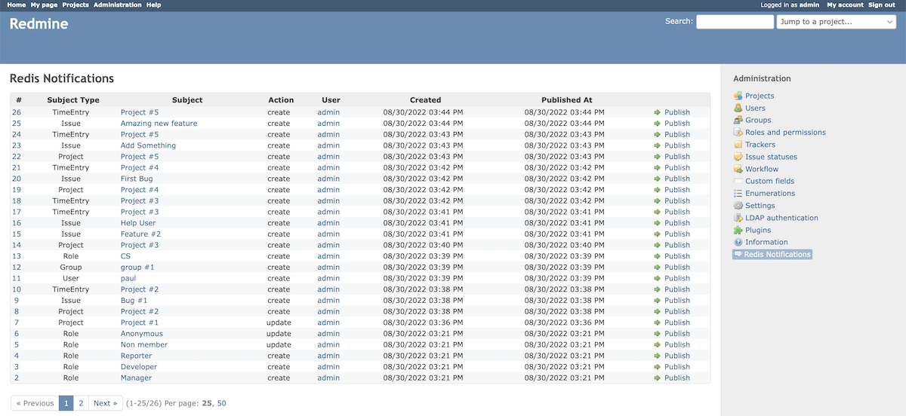
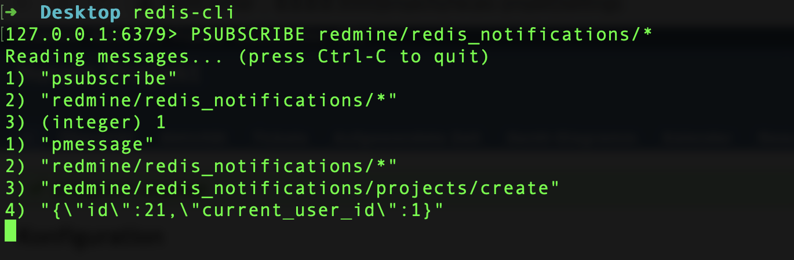

# 📣 Redmine Redis Notifier
[](https://github.com/dotruby/redmine_redis_notifier/actions/workflows/ci.yml)

This Redmine Plugin enhances several core models to make use of a Redis PubSub logic. Whenever such objects are created/updated/deleted, a message is published on a specific Redis channel. You could then implement you own subcription logic and use Redis subscripe feature to further work with the given message information in any way you want. Use cases could be something like:

* On project creation also create a folder structure on the file server
* On user creation add the user to certain lists
* On issue removal also remove a github issue
* Send an email on certain actions
* etc. (possibilites are endless)

This plugin targets Redmine 5.x, but should work with 4.2.7 as well. Thanks to [Digital Online Media GmbH](https://www.dom.de) for allowing us to open source this.





## 🚀 Install

1. Ensure that Redis is running on your server and the connection is either defined by the default localhost connection or set with the `REDIS_URL` environment variable, e.g.
```
export REDIS_URL=redis://localhost:6379
```

2. Install the plugin with cloning the code into your `plugin` directory in your Redmine installation, e.g.
```
git clone https://github.com/dotruby/redmine_redis_notifier
```

3. Run bundle install to install the redis gem:
```
bundle install
```

4. Run plugin migrations:
```
RAILS_ENV=production bundle exec rake redmine:plugins:migrate NAME=redmine_redis_notifier
```

5. Restart redmine to pick up the changes

## 📝 Usage

Each internal object event is stored in a new table `redis_notifications`. You can also view the notifications in Redmine in the admin section. If a message needs to be resend for any reason, you can do so as well.

If you want you can disable the creation of redis notifications for certain models in the configuration section of the plugin. If disabled, the redis notification record will be not be stored upon object action and thus no redis message will be published.

The subscription logic for the Redis channels is totally up to you. An easy example on how to deal with Redis subscriptions in Ruby can be found [here](https://github.com/redis/redis-rb/blob/master/examples/pubsub.rb), but you can of course use any language to implement your own needs. You could also use pattern subscribe to subscribe to all `redis_notifications` in Redis:
```
PSUBSCRIBE redmine/redis_notifications/*
```

## 🤖 Events and actions

These mentioned models are tracked with the corresponding actions. Internally Rails callbacks are used on the model layer, so the plugin patches the models with enhanced logic. The information sent to the channels is very minimal, it's basically only the object id and the user who performed the change. The idea is to call the Redmine REST API for retrieving the full object data and performing your own actions after you subscribed to the events.

| Model  | Actions | Redis publish channel | Message Data |
| ------------- | ------------- | ------------- | ------------- |
| Group  | `create\|update\|destroy`  | `redmine/redis_notifications/groups/#{action}` | `{"id": 1, "current_user_id": 1}` |
| Issue  | `create\|update\|destroy`  | `redmine/redis_notifications/issues/#{action}` | `{"id": 1, "current_user_id": 1}` |
| Member  | `create\|update\|destroy`  | `redmine/redis_notifications/members/#{action}` | `{"id": 1, "current_user_id": 1}` |
| Project  | `create\|update\|destroy\archive\unarchive`  | `redmine/redis_notifications/projects/#{action}` | `{"id": 1, "current_user_id": 1}` |
| Role  | `create\|update\|destroy`  | `redmine/redis_notifications/roles/#{action}` | `{"id": 1, "current_user_id": 1}` |
| TimeEvent  | `create\|update\|destroy`  | `redmine/redis_notifications/time_events/#{action}` | `{"id": 1, "current_user_id": 1}` |
| User  | `create\|update\|destroy`  | `redmine/redis_notifications/users/#{action}` | `{"id": 1, "current_user_id": 1}` |

## 🚛 REST APi

You can also get all redis_notifications with REST API calls (`GET /redis_notifications.xml` or `GET /redis_notifications.json`). For an  individual redis_notification use `GET /redis_notifications/1.xml` or `GET /redis_notifications/1.json`

## 🗑️ Uninstall

1. Remove the database table:
```
RAILS_ENV=production bundle exec rake redmine:plugins:migrate NAME=redmine_redis_notifier VERSION=0
```
2. Remove `redmine_redis_notifier` folder in the plugins folder:
```
rm -r redmine_redis_notifier
```
3. Restart Redmine to pickup the changes


## 📙 Changelog
### HEAD (not yet released)

### v0.1.0
* Track Member change as well

### v0.0.1
* Initial Release


